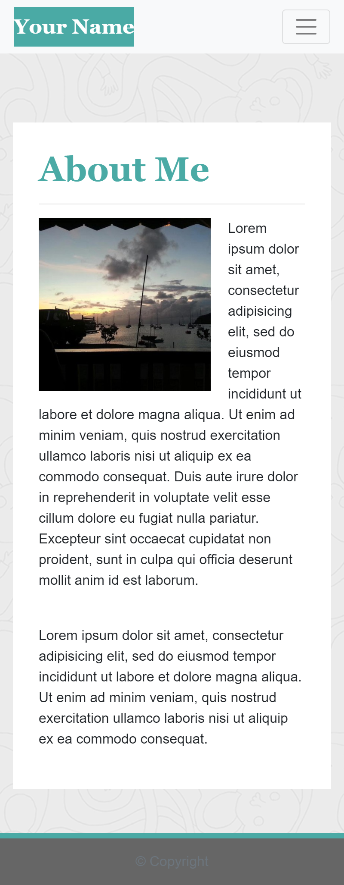
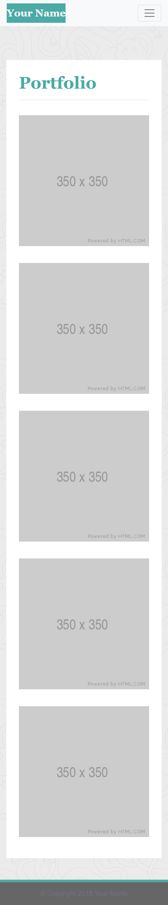

# Responsive Porfolio
## Description
Mobile responsive portfolio using the Bootstrap CSS Framework. The site contain a navbar, a responsive layout, and responsive images. The navbar collapses to a button and the portfolio cards stack in a single column when the screen size is less than md (medium). The responsive behavior is built entirely with Bootstrap. The portfolio does not use any additional media queries. The HTML code was validated at [W3C Markup Validation Service](https://validator.w3.org/)

Deployed at [GitHub Pages](https://danielryangreen.github.io/portfolio/)

See the repo at [Github](https://github.com/danielryangreen/)
## Installation
Open __index.html__ in your favorite browser!

View the code in your favorite text editor. I suggest VS Code.
## Usage
Here is a mock-up of the site for mobile phone screens.

## Credits
Built with [Bootstrap 5.0](https://getbootstrap.com/)

In addition to the Bootstrap documentation, I used examples from [w3schools](https://w3schools.com/bootstrap4/)

Screenshot images were provided by [Trilogy Education Services](https://trilogyed.com/)
## License
MIT License